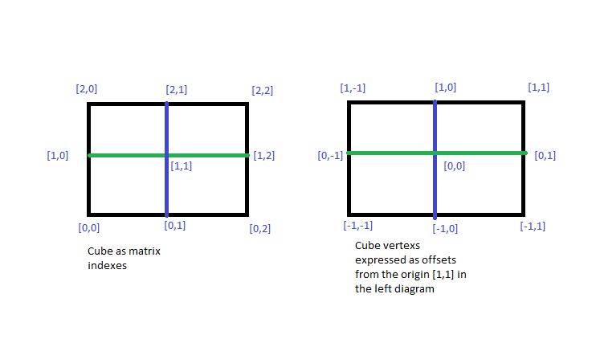
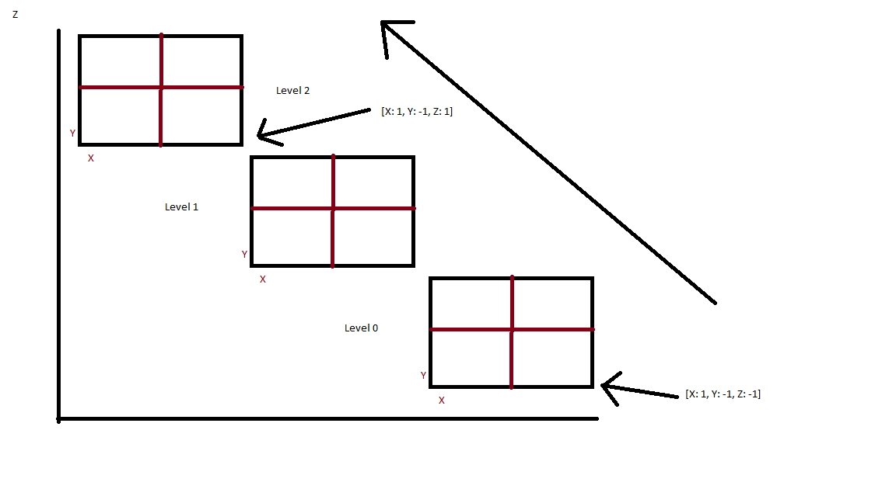

# Vertex Generator 
The vertex generator is a tool to pre-calculate all the positions for a mesh.
This is in order to expose mesh state as a graph entry and allow graph-based semantics between them

# _Why?_
As an experimental alternative to marching cubes. Using a graph based mesh generator
allows hypothetically infinite variability in the mesh.

For the sake of this project, and contributor sanity, this generator
only works with 6 faced cubes with each face having 9 vertices,
8 shared around the edges, and one unshared central vertex

Note: I made these in paint

 

The Left image is a cube expressed as how it will be stored in a 2d matrix, the right is the mesh data offset from origin
In the above photo, this face can be viewed as the bottom or top face of the cube, viewing from a higher or lower perspective on the Z axis

So for 3d, we will need 3 rows of 2d matrices

We express all cube data as matrix entries increasing on the Z axis.

#Design
The above defines what a cube is within the context of this tool, but to express the design we need to redefine a cube in a more abstract sense

A **Cube** is both a cube of geometric shape, in that all sides are equal, but that it is also the mesh that takes up a percent of that space
between completely filling the bounds, or being completely empty.

To modify a world of cubes effectively, a **Cube** knows all the rules around it's manipulation, a canonical example, is you can dig down into dirt. 
The Dirt cube has rules about how it can be transformed by digging, these are **CubeDeltas**

A **CubeDelta** is a link between two cubes, the cubes are thus vertexes within a graph of cube states, and a **CubeDelta**
is a valid edge between them. A **CubeDelta** is a collection of the values changed by their index within the cube, thus the progenitor **Cube** can convert into the new **Cube** and back based off this pregenerated data.

Because a cube delta is a product of a set of rules applied to a cube, they also contain a set of meta data. This is so we can handle rules around terrain that 'flows' after a certain slope, or can be arbitrarily manipulated.

Thus after pre-generating all cube data, an entity can modify the cube in O(1) time as it is a rule based delta lookup.

# Contributing
Currently I have no concrete vision of where this is going, but feel free to open issues or contribute PR's,
if you believe a feature is critical for this to be viable